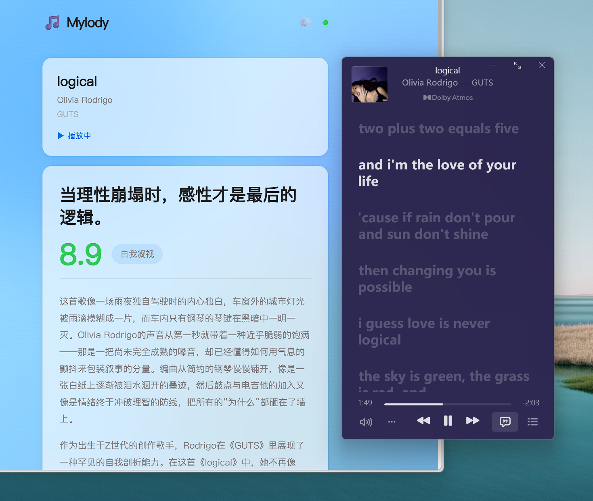
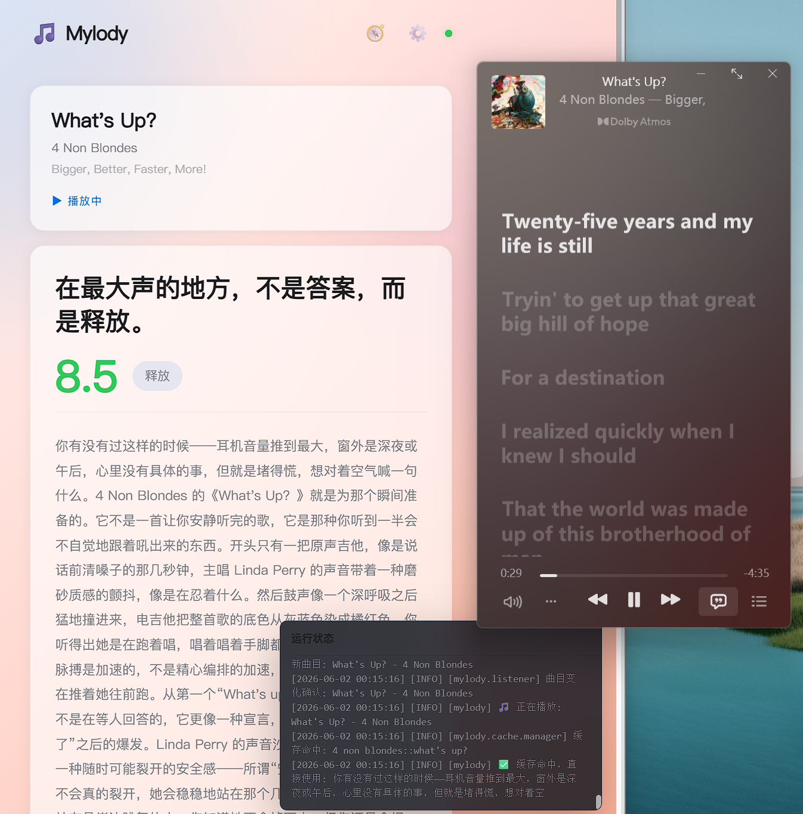

# Mylody：音乐折射出生命的每一面

<p align="center">
  
</p>

> I'm a mirrorball and I'll show you every version of yourself tonight.

Mylody 是一个音乐乐评 AI Agent。它通过监听当前播放的歌曲，调用大语言模型生成一篇乐评，进而追踪你的音乐人格。

灵感来源：[Melory](https://apps.apple.com/cn/app/id6756657818)

本项目为 2025-2026-2 学期《AI 智能体产品设计》课程地 13 周作业。如有建议欢迎给我发邮件，联系方式在主页。

## 功能

- **自动监听** — 通过 Windows SMTC API 实时检测当前播放的歌曲，支持 Spotify、网易云音乐、Apple Music、Windows Media Player 等主流播放器
- **AI 乐评生成** — 调用 OpenAI 兼容接口生成文乐评，包含情绪金句、评分、相似推荐
- **反幻觉机制** — 基于 MusicBrainz 音乐元数据和 Wikipedia 背景资料构建证据包，对无证据的高风险事实断言和歌词主题断言进行自动拦截
- **本地缓存** — SQLite 存储，同一首歌只请求一次 AI，后续直接读取缓存，支持 TTL 过期策略
- **音乐人格** — 基于历史乐评时间线，AI 生成你的「镜像音乐人生」分析，包括音乐人格画像、情绪模式、声音偏好等

## 快速开始

### 1. 创建虚拟环境

```bash
py -3.11 -m venv .venv
.venv\Scripts\activate
```

### 2. 安装依赖

```bash
pip install -r requirements.txt
```

### 3. 配置 API Key

首次运行会自动从 `config.example.yaml` 复制生成项目根目录下的 `config.yaml`，编辑填写你的 API Key：

```yaml
ai:
  api_key: "YOUR_API_KEY"              # 填写你的 API Key
  model: "deepseek-chat"               # 模型名称
  base_url: "https://api.deepseek.com" # OpenAI 兼容接口地址
```

支持任何 OpenAI 兼容接口，例如 DeepSeek、通义千问、Moonshot 等。

### 4. 启动

```bash
python main.py
```

浏览器打开 http://localhost:5800。也可以直接双击 `start.bat` 一键启动。这个脚本文件会关闭你的 Mylody（如果正在运行），并重新开启。

## 环境要求

| 依赖 | 版本 | 说明 |
|---|---|---|
| Windows | 10/11 | 需要 Windows Media Control API (SMTC) 支持 |
| Python | 3.11+ | 推荐 3.11，兼容 3.12 / 3.13 |
| 网络 | 需要 | 调用 AI API 和 MusicBrainz 需要网络连接 |

> **注意**：本项目依赖 `winsdk` 库，仅支持 Windows 系统。

## 项目结构

```
mylody/                         后端 Python 包
├── ai/                         AI 模块
│   ├── client.py               AI 客户端：Prompt 组装 → Provider 调用 → JSON 解析 → 校验
│   ├── guardrails.py           反幻觉校验：高风险断言拦截、主题断言检测
│   ├── personality.py          音乐人格生成
│   ├── prompts/                Prompt 模板（乐评 / 修复 / 人格）
│   ├── provider_base.py        AI Provider 基类
│   └── provider_openai.py      OpenAI 兼容 Provider 实现
├── cache/                      SQLite 缓存管理
│   ├── manager.py              乐评缓存管理器
│   ├── journey.py              乐评时间线（供音乐人格分析）
│   └── personality.py          音乐人格缓存
├── evidence/                   外部证据服务
│   ├── service.py              MusicBrainz + Wikipedia 证据整合
│   ├── client.py               MusicBrainz API 客户端
│   ├── external_service.py     Wikipedia 背景搜索
│   └── bundle_formatter.py     证据包格式化
├── listener/                   Windows 媒体会话监听
│   ├── media_session.py        WinRT 媒体会话封装
│   └── debounce.py             防抖处理
├── server/                     FastAPI 路由
│   ├── app.py                  应用工厂
│   ├── routes_review.py        乐评 API（查询 / 刷新 / 缓存管理）
│   ├── routes_personality.py   音乐人格 API
│   ├── routes_music.py         MusicBrainz 搜索 API
│   ├── routes_status.py        服务状态 API
│   ├── routes_config.py        配置查询 API
│   └── routes_logs.py          日志查看 API
├── utils/                      工具函数
├── config.py                   配置管理
├── tray.py                     系统托盘
└── types.py                    数据结构（MediaInfo / ReviewData）

web/                            前端静态文件
├── index.html                  主页面
├── css/                        样式（模块化：极光动画 / 布局 / 组件）
└── js/                         JavaScript（API 调用 / 状态管理 / 模态框）

tests/                          测试文件
config.example.yaml             配置示例
main.py                         入口文件
start.bat                       Windows 一键启动脚本
```

## 配置说明

配置文件位于项目根目录 `config.yaml`，首次运行时自动从 `config.example.yaml` 复制生成。主要配置项：

```yaml
ai:
  api_key: "YOUR_API_KEY"              # OpenAI 兼容 API Key
  model: "deepseek-chat"               # 模型名称
  base_url: "https://api.deepseek.com" # 接口地址
  timeout_seconds: 30                  # 请求超时
  max_retries: 2                       # 失败重试次数

listener:
  poll_interval_seconds: 2             # 检测播放状态的频率（秒）
  debounce_seconds: 3                  # 歌曲稳定播放多久后触发乐评（秒）
  excluded_apps: []                    # 排除的应用进程名

cache:
  enabled: true
  cache_ttl_days: 0                    # 0 = 永不过期；正整数按天过期

evidence:
  wikipedia_language: "en"             # Wikipedia 语言版本（en / zh）

display:
  show_in_tray: true                   # 系统托盘图标
  language: "zh-CN"                    # 乐评语言

server:
  host: "127.0.0.1"
  port: 5800

logging:
  level: "INFO"                        # DEBUG | INFO | WARNING | ERROR
```

## 开发日记

### 2026-05-28 周四
今天的工作是完成项目脚手架搭建，构建最小可行产品。目前的问题是界面太丑、功能太少，AI 幻觉太严重，主要是乐理分析的部分，全是瞎编的。明天重点优化这些方面。


<sub>今天在听 Matilda by Harry Styles</sub>

### 2026-05-29 周五
今天在忙别的项目，原本的计划是今天做 AI 反幻觉，但是实际上是做了前端优化。给项目加了极光效果，灵感来自我之前的个人网站。初步确立了反幻觉技术路线。实操放在周末。


  <sub>今天在听 the Saltwater Room by Owl City</sub>

### 2026-05-30 周六
今天把项目改崩了，一条乐评都出不来了。fuck

### 2026-05-31 周日
已经修复 bug，可以正常输出乐评了，而且输出的乐评也看着正常了一些。反幻觉的工作暂时就做到这里吧。

明天的工作是加记忆功能，读取用户播放的时间、曲目、持续时长，利用 AI 能力输出最近的“音乐人格”。然后加一些其他功能。



  <sub>今天在听 logical by Olivia Rodrigo</sub>

### 2026-06-01 周一
新增音乐人格功能，根据历史听歌记录分析你的音乐人格。



  <sub>今天在听 What's Up? by 4 Non Blondes</sub>