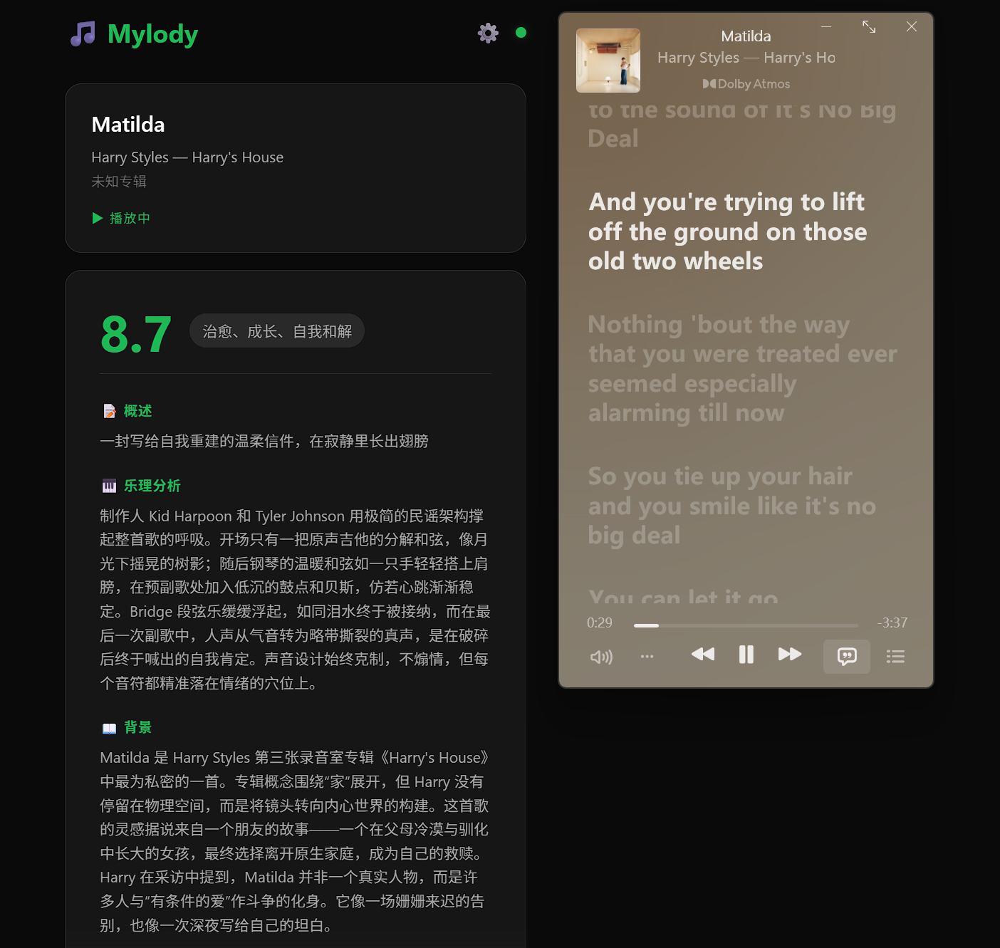
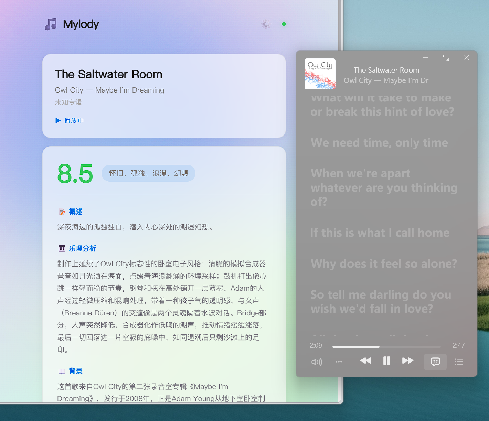

# Mylody AI Agent

音乐乐评 AI Agent — 自动识别当前播放的音乐，调用 AI 生成专业乐评。

本项目灵感来源为 iOS 应用 Melory，下载地址：https://apps.apple.com/cn/app/id6756657818

本项目为 2025-2026-2 学期《AI 智能体产品设计》课程第 13 周作业。

如有建议欢迎给我发邮件。我的联系方式在主页。

## 功能

- **自动监听**：通过 Windows SMTC API 读取当前播放的歌曲信息（支持 Spotify、网易云、Apple Music 等）
- **AI 乐评**：调用小米 Mimo 生成专业中文乐评，包含情感分析、乐理解析、创作背景等
- **本地缓存**：SQLite 存储，同一首歌只请求一次 AI，后续直接读取缓存
- **Web 界面**：浏览器打开 `http://localhost:5800` 查看乐评

## 环境要求

| 依赖 | 版本要求 | 说明 |
|---|---|---|
| Windows | 10/11 | 需要 Windows Media Control API 支持 |
| Python | 3.11+ | 推荐 3.11，兼容 3.12/3.13 |
| 网络 | 需要 | 调用 AI API 需要网络连接 |

> **注意**：本项目依赖 `winsdk` 库，仅支持 Windows 系统。

## 快速开始

### 1. 创建虚拟环境

```bash
py -3.11 -m venv .venv
.venv\Scripts\activate
```

### 2. 安装依赖

```bash
pip install -r requirements.txt
```

### 3. 配置 API Key

首次运行会自动生成 `~/.mylody/config.yaml`，编辑填写你的 API Key：

```yaml
ai:
  provider: "mimo"          # 目前仅支持小米 Mimo
  api_key: "YOUR_API_KEY"   # ← 填写你的 Mimo API Key
  model: "mimo-v2.5-pro"    # 默认模型
```

### 4. 启动

```bash
python main.py
```

浏览器打开 http://localhost:5800

## 命令行参数

```bash
python main.py --port 8080          # 指定端口
python main.py --config ./my.yaml   # 指定配置文件
```

## 支持的 AI 提供商

目前仅支持**小米 Mimo**，配置值为 `mimo`。

- 默认模型：`mimo-v2.5-pro`
- 接口地址：`https://api.xiaomimimo.com/v1`
- 支持联网搜索功能，可自动补充音乐背景信息

## 项目结构

```
mylody/              # 后端（Python + FastAPI）
├── ai/              AI 请求模块（Prompt + Provider）
├── cache/           SQLite 缓存管理
├── listener/        Windows 媒体会话监听
├── server/          FastAPI 路由
└── utils/           工具函数

web/                 # 前端（HTML + CSS + JS）
├── index.html
├── style.css
└── app.js
```

## 配置说明

配置文件位于 `~/.mylody/config.yaml`，主要配置项：

```yaml
ai:
  provider: "mimo"          # 目前仅支持小米 Mimo
  api_key: "YOUR_API_KEY"   # Mimo API Key
  model: "mimo-v2.5-pro"    # 默认模型
  timeout_seconds: 15

listener:
  poll_interval_seconds: 2   # 检测频率
  debounce_seconds: 3        # 防抖时间
  excluded_apps: []          # 排除的应用

cache:
  enabled: true
  cache_ttl_days: 0          # 0 = 永不过期

server:
  host: "127.0.0.1"
  port: 5800
```

## 开发日记

### 2026-05-28 周四
今天的工作是完成项目脚手架搭建，构建最小可行产品。目前的问题是界面太丑、功能太少，AI 幻觉太严重，主要是乐理分析的部分，全是瞎编的。明天重点优化这些方面。



<sub>今天在听 Matilda by Harry Styles</sub>

### 2026-05-29 周五
今天在忙别的项目，原本的计划是今天做 AI 反幻觉，但是实际上是做了前端优化。给项目加了极光效果，灵感来自我之前的个人网站。初步确立了反幻觉技术路线。实操放在周末。



<sub>今天在听 the Saltwater Room by Owl City</sub>